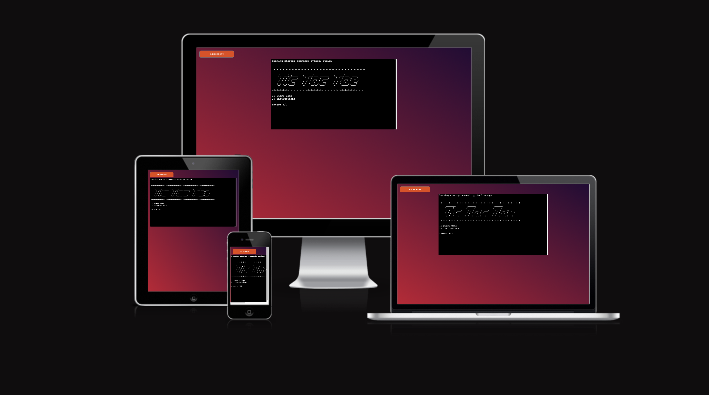
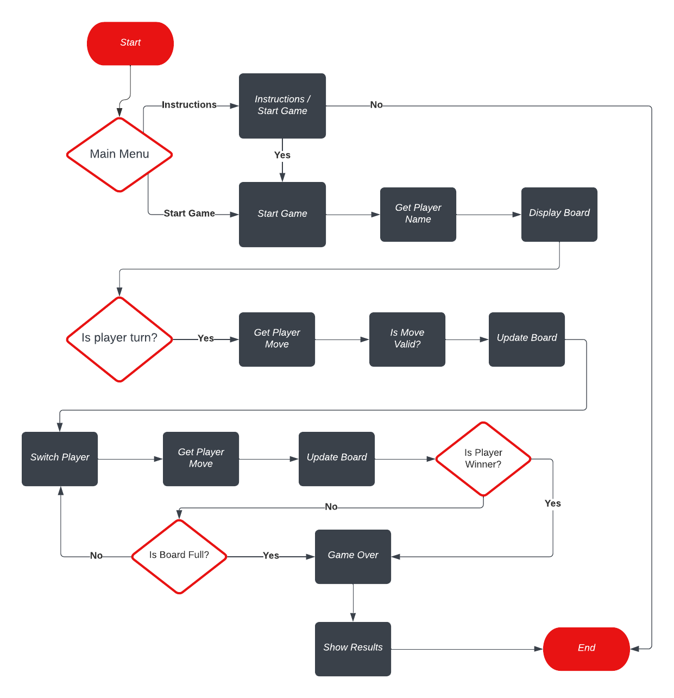
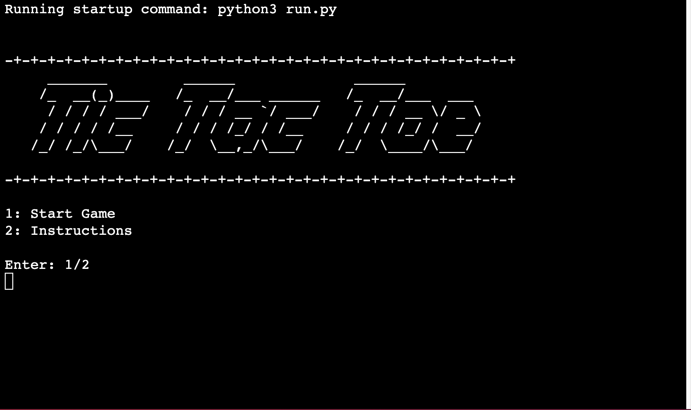
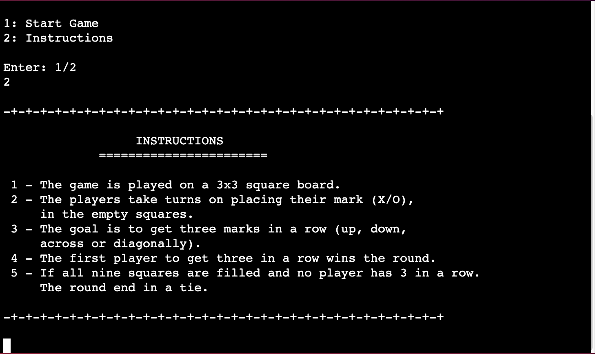
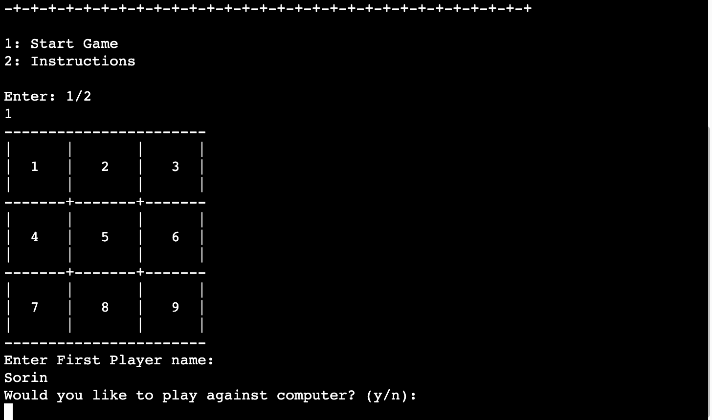
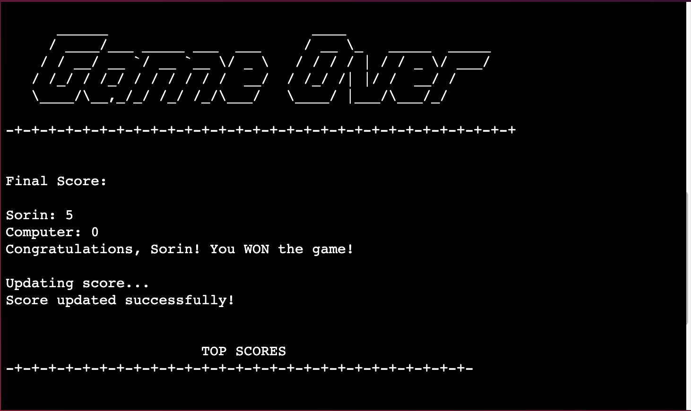
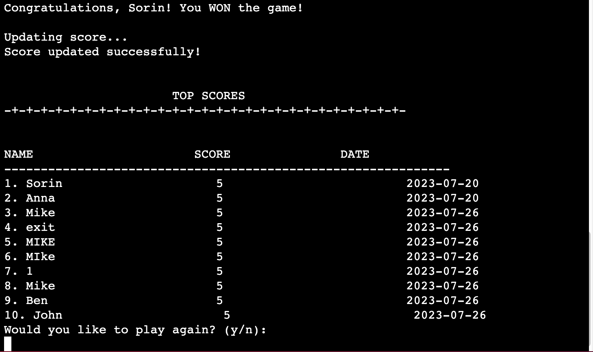
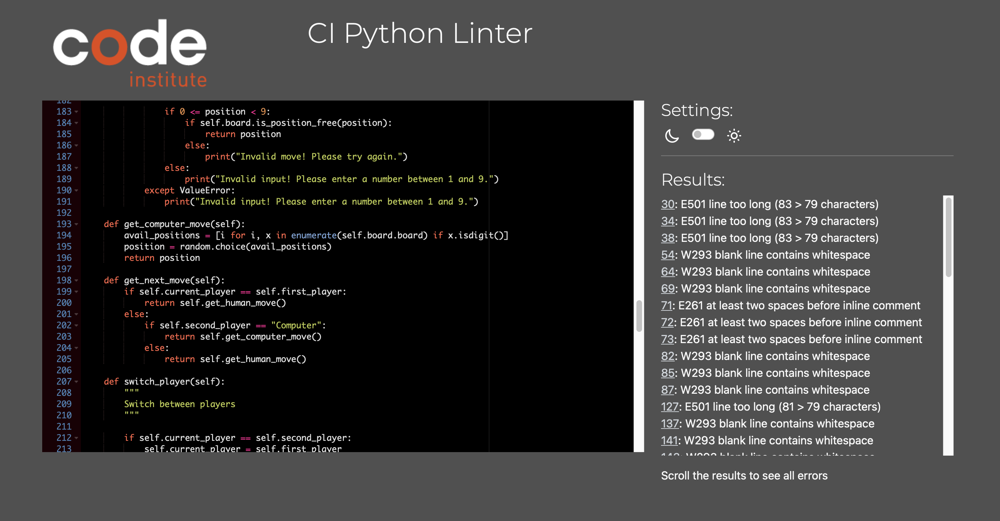

# Tic Tac Toe

Tic Tac Toe is a simple terminal game that can be played against another player or against the computer. The gameboard is grid of 3 squares by 3 squares. The players choose their marks between X and O and then take turns placing their marks on the empty squares. The goal of the game is to place 3 marks in a row (up, down, across or diagonally).

[View Live Site](https://tic-tac-toe-g-e198203b2fcd.herokuapp.com)

---

## Contents

---

## User Experience (UX)

### User Stories

#### Target Audience

Tic Tac Toe is a classic game and it's fun for all ages.

#### First Time Users

- As a first time user, I want to easily understands the purpose of the game.
- As a first time user, I want to be able to see clear instructions on how to play.
- As a first time user, I want to be able to play against another player or computer.
- As a first time user, I want to choose my mark (X - O).
- As a first time user, I want to be notified when making an invalid move.
- As a first time user, I want to be able to play again and quit the game.
- As a first time user, I want to se my score after the game ends.

#### Returning Users

- As a returning user, I want to easily start a new game.
- As a returning user, I want to see the last top scores.

### Goals

- Easy and intuitive gameplay. Providing enough instructions so the users can play the game without confusion.
- Giving clear and informative feedback to the user after each move.
- Easy menu navigation.
- Input validation. Prompt the users when invalid moves or inputs are made.
- Top scores. The users should be able to see the last top scores.

## Design

### Flowchart

## Features

### Existing Features

#### Main Menu

When the user starts the aplication they first see the Logo and Main Menu. Here the user can choose to start the game or see the instructions.

#### Instructions

The user can choose to see the instructions of the game from the main menu.

#### Multiplayer option

When the game starts, the user can input their name and then choose to play against computer or another player.

#### Game Over

After the five rounds are played, the game is over. The top scores are then updated with the winner's name, score and date.

#### Top Scores

After the top scores are updated. A list of the highest 10 top scores will be displayed.

### Future Features

- Add some more colors to the text so it will be easier for the user to see the game context.
- Make the Computer smarter. Right now it chooses the moves only randomly.

## Testing

### Python Validation

Used Code Institute's own python validator [CI Python Linter](https://pep8ci.herokuapp.com/)

Python

## Bugs

## Technologies Used

### Languages

- [Python](https://www.python.org)

### Libraries

- [Random](https://docs.python.org/3/library/random.html?highlight=random#module-random) - Used for the Computer moves.

### Tools

- [GitHub](https://github.com) - Used for storing the code.
- [Git](https://git-scm.com) - Used for version control.
- [VSCode](https://code.visualstudio.com) - Used to develop the game.
- [LucidChart](https://www.lucidchart.com/pages/) - Used for making flowcharts.
- [Pipenv](https://docs.python-guide.org/dev/virtualenvs/) - For creating virtual environment and installing packages.
- [CI Template](https://github.com/Code-Institute-Org/p3-template) - Used when creating the repository on GitHub.
- [Bear](https://bear.app) - For planning the development, keeping notes and ideas.

## Deployment

## Development

### How to Fork

To Fork this project:

1. Log in to GitHub.
2. Go to the project's repository [Tic-Tac-Toe](https://github.com/SorinPan/tic-tac-toe/tree/main).
3. Click on the Fork button at the top.

### How to Clone

To Clone this project:

1. Log in to GitHub.
2. Go to the project's repository [Tic-Tac-Toe](https://github.com/SorinPan/tic-tac-toe/tree/main)
3. Click on the <> Code button at the top of the file list.
4. Choose to clone using either HTTPS, SSH key or GitHub CLI, then copy the link provided.
5. Go to your code editor and open a Terminal.
6. Change the current working directory to the location where you want the cloned directory.
7. Type in git clone, then press "Spacebar" and paste the link you copied earlier.
8. Press "Enter" to create your clone repository.

## Credits

## Comments
